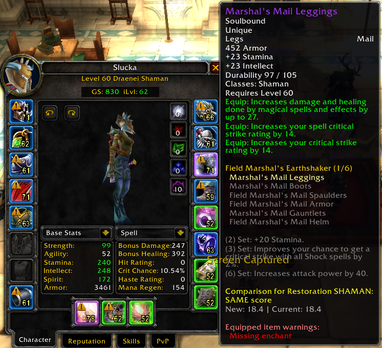

# GearGuardian

**Version 2.5** - Your Ultimate TBC Classic Gear Management Companion



## Features

### 🌟 Universal GearScore & Item Level Display
- **Hover over ANY player** to see their GearScore and Average Item Level instantly
- No need to open inspect frame - just hover your mouse
- Works everywhere: world, raids, battlegrounds, dungeons
- Color-coded display for easy reading

### 🛡️ Enchant & Gem Monitoring
- Yellow warning icons (⚠️) on items missing enchants or containing empty gem sockets
- Works on **YOUR character AND inspected targets**
- Perfect for raid leaders checking team readiness
- Detects all TBC enchants (Head, Shoulders, Legs, Chest, Weapons, etc.)

### 📊 GearScore System
- Professional GearScore calculation for TBC Classic
- Color-coded tiers: gray/white/green/blue/purple/orange
- Displayed on character frame and inspect frame
- Uses TBC-appropriate formulas (400 points per tier)
- Shift+Click to drag and reposition GS/iLevel displays anywhere you want
  - GS and iLevel frames move independently of each other
  - Positions are saved per-frame and persist between sessions
  - Works on both character and inspect frames
  - Use `/gg reset` to restore default positions

### 🔍 Full Inspect Frame Integration
When you inspect another player, you see:
- ✓ Their GearScore and Average Item Level
- ✓ Missing enchants (yellow warning icons)
- ✓ Empty gem sockets (yellow warning icons)
- ✓ Item quality borders on all their gear
- ✓ Item levels on each piece

### ⚔️ Intelligent Gear Comparison
- Automatically detects your specialization
- Custom stat weights for each class/spec
- Color-coded comparison tooltips (green for upgrade, red for downgrade)

### 🎨 Quality Borders
- Colored glowing borders around equipped items based on quality
- Works on character frame and inspect frame

## Installation

1. Download the latest release
2. Extract the `GearGuardian` folder to your `World of Warcraft\_classic_\Interface\AddOns\` directory
3. Restart WoW or type `/reload` in-game

## Usage

### Commands
- `/gg` or `/gg config` - Open configuration panel
- `/gg toggle` - Enable/disable addon
- `/gg reset` - Reset GS/iLevel frames to default positions
- `/gg debug` - Debug enchant/gem checking

### Configuration
Open the configuration panel with `/gg` to customize:
- Quality Borders
- Item Level Display
- Gear Comparison
- GearScore & Average iLevel
- Enchant Check
- Gem Check

## Technical Details

### Modular Code Structure
Version 2.2 features a complete code refactoring:

```
GearGuardian/
├── core/
│   ├── init.lua          - Namespace and library initialization
│   ├── helpers.lua       - Helper functions
│   └── config.lua        - Configuration system
├── modules/
│   ├── enchants.lua      - Enchant and gem checking
│   ├── gearscore.lua     - GearScore calculation
│   ├── itemlevel.lua     - Item level calculation and display
│   ├── comparison.lua    - Stat weights and item comparison
│   └── borders.lua       - Quality borders and slot updates
├── ui/
│   ├── config-panel.lua  - Configuration GUI
│   └── tooltips.lua      - Tooltip integration
├── Libs/                 - Required libraries
│   ├── LibStub
│   ├── CallbackHandler-1.0
│   ├── LibDetours-1.0
│   └── LibClassicInspector
├── GearGuardian.lua      - Main file with events and slash commands
└── GearGuardian.toc      - TOC file
```

### Dependencies
- LibStub
- CallbackHandler-1.0
- LibDetours-1.0
- LibClassicInspector

All dependencies are included in the addon.

## Changelog

See [CHANGELOG.md](CHANGELOG.md) for the full changelog.

### Version 2.5 (2026-02-11)
- Fixed iLevel frame disappearing or misplaced after drag (position reference bug from v2.4)
- GS and iLevel frames are now fully independent (drag each separately)
- Added `/gg reset` command to restore default frame positions

### Version 2.4 (2026-02-06)
- Added draggable GS & iLevel displays (Shift+Click to drag)
- Positions saved per-frame and persist between sessions
- Frames automatically follow parent when it moves
- Fixed frame level for inspect frames to stay above 3D models

### Version 2.3 (2026-02-03)
- Major performance optimization update
- Implemented intelligent cache systems (70-80% faster)
- Optimized GearScore and iLevel calculations
- Timer optimization for inspect flow
- Item usability validation (class/armor restrictions)
- UI improvements and repositioned displays

### Version 2.2 (2026-01-29)
- Complete code refactoring into modular structure
- Fixed inspect frame quality borders on target's items
- Fixed warning icons for missing enchants/gems on inspected players
- Fixed item level display on inspected player's items
- Fixed GearScore and average iLevel display on inspect frame
- Improved error handling and initialization

### Version 2.1 (2025-01-28)
- Added LibClassicInspector integration
- Universal GearScore & iLvl tooltips
- Enhanced inspect frame with enchant/gem warnings
- Professional configuration panel with scrolling
- Yellow warning triangle icons

### Version 2.0 (2025-01-28)
- Initial release
- Quality borders, item level display
- Spec-based gear comparison
- Enchant and gem checking

## Perfect For

- Raid leaders checking if members are enchanted/gemmed
- Guild officers enforcing gear standards
- Recruiters evaluating applicants' gear quality and GearScore
- PvPers ensuring arena partners are optimized
- Anyone who wants to track their own gear

## Author

Created by **Sluck**

## License

Copyright (c) 2025 Sluck. All Rights Reserved.

This addon and all its contents are protected by copyright law.
You may use this addon for personal use only.
Redistribution, modification, or commercial use is prohibited without explicit permission.

## Support

If you encounter any issues or have suggestions, please open an issue on GitHub.
